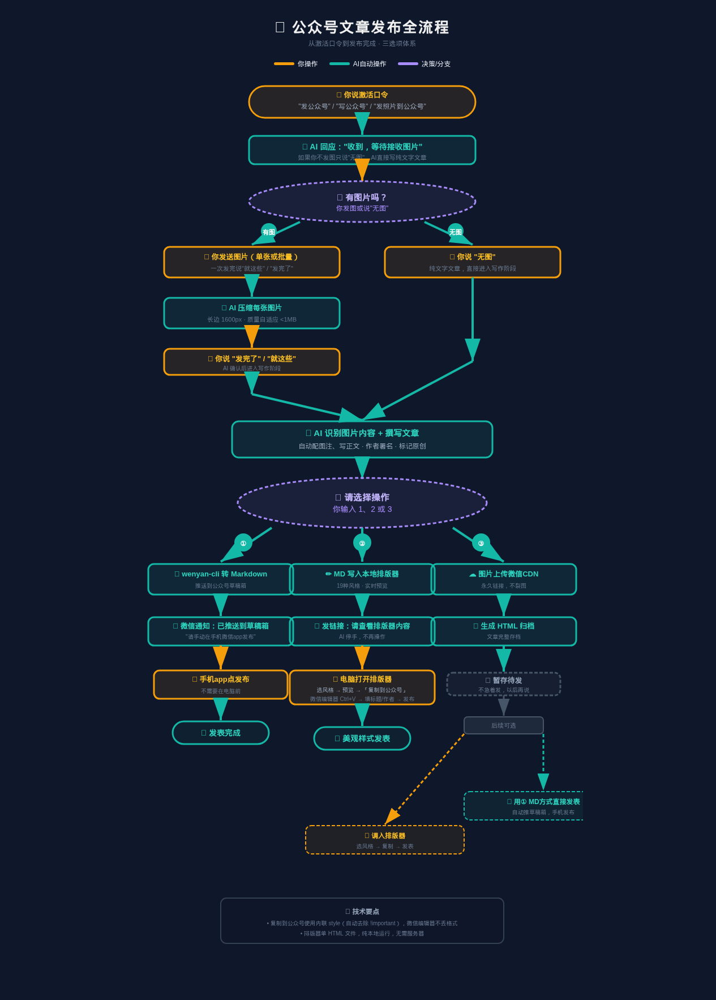
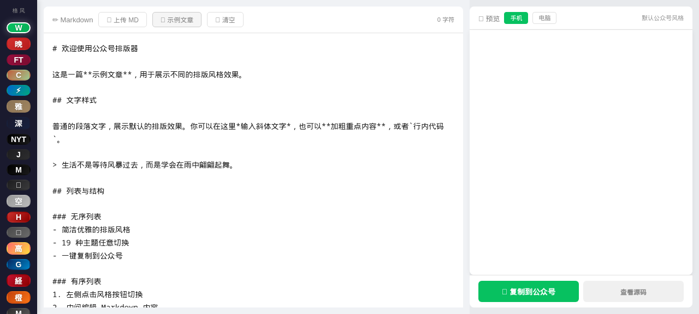

# 📸 wechat-auto-publisher

> *只想发图不想码字？交给 AI 吧。*

公众号排版器 + AI 写作助手。出去旅游拍了照片，懒得写文章？把图丢过来，AI 自动识别内容、配文配图、排版美化，一键复制到公众号。

---

## ⚠️ 前置准备

**①发表**（自动推草稿）需要配置微信公众平台 API，**②美化 + ③存档**则跳过此步直接使用。

### 配置步骤

1. 登录 [微信公众平台](https://mp.weixin.qq.com) → **设置与开发** → **基本配置**
2. 获取 **AppID** 和 **AppSecret**（点重置生成，保存好不再显示）
3. 在 **IP白名单** 中添加 API 调用方的出口 IP：
   - 服务器 IP 固定 → 直接加服务器公网 IP
   - 服务器 IP 不固定（家庭宽带）→ 用 CF Worker 代理，加 CF 出口 IP 段：`162.158.0.0/15`, `172.64.0.0/13` 等（不支持 IPv6）
4. 将获取到的 `APP_ID` 和 `APP_SECRET` 写入系统环境变量或配置文件

> 💡 **②美化 + ③存档**不需要任何 API 配置，直接打开排版器即可使用。

---

## 📦 安装

### 前提

- **Git**（克隆仓库用）
- **浏览器**（排版器是纯前端 HTML，打开即用）
- **Node.js ≥ 18**（可选，用于本地 HTTP 服务）

### 克隆

```bash
git clone https://github.com/uokooo/wechat-auto-publisher.git
cd wechat-auto-publisher
```

### 打开排版器

直接双击 `index.html`，或启动本地服务：

```bash
# 方法一：Python
python3 -m http.server 8080
# 浏览器打开 http://localhost:8080

# 方法二：Node.js
npx serve .
```

---

## ✨ 功能一览

| 功能 | 说明 |
|------|------|
| 📸 AI 看图写文 | 发照片给 AI，自动分析内容，配图注、写正文 |
| 🎨 19 种排版风格 | 默认 / 晚点 / 金融时报 / Claude / 纽约时报 / Apple 极简 / 原研哉·空 / 高迪·有机 / Guardian / Nikkei 等 |
| 📱 实时预览 | 手机 / 电脑双视图，所见即所得 |
| 📋 一键复制 | 内联样式，微信编辑器不丢格式 |
| 💾 纯前端离线可用 | 单 HTML 文件，无服务器，无依赖 |
| ☁️ 图片自动传 CDN | 微信图床永久链接，不裂图 |
| 📦 存档暂存 | 不急着发的存 HTML，改天再调出排版 |

---

## 🎯 使用场景

### 场景一：人在外面，只有手机（AI 全自动）

```
你：「发公众号」+ 发几张照片
AI：自动识别照片内容 → 写文章 → 推送到草稿箱
你：打开手机微信 app，点一下「发布」
```

### 场景二：坐在电脑前，想好好排版

```
AI：文章写好了
你：选②美化
AI：Markdown 写入本地排版器，发链接给你
你：浏览器打开 → 切风格 → 复制 → Ctrl+V 到公众号
```

### 场景三：还没想好发不发

```
选③存档：AI 帮你存 HTML 归档
过几天想发了：调入排版器 / 直接发表，都行
```

---

## 🔄 完整工作流程



1. **你说激活口令**：`发公众号` / `写公众号`
2. **AI 回应**：收到，等待接收图片
3. **发图** → AI 识别内容写文章 / **说"无图"** → AI 纯文字创作
4. **你选**：
   - **① 发表** → MD 转公众号草稿箱 ⚠️ 需先配好微信 API 白名单（见上方前置配置）
   - **② 美化** → 打开排版器，手动切风格再发布
   - **③ 存档** → 存 HTML 归档，改天再处理
5. 按选择路径走完

---

## 🚀 快速开始

### 方式一：AI 助手全自动（推荐）

找一个支持工具调用的 AI 助手（如 Hermes Agent），把仓库里的 [`AI助手工作流.md`](./AI助手工作流.md) 喂给它，然后说 **"发公众号"**。它会自动完成：识图 → 写文 → 排版 → 发布三选一。

### 方式二：纯手动使用排版器

1. 克隆仓库 → 打开 `index.html`
2. 写 Markdown（或点"示例文章"看看效果）
3. 左侧点风格按钮切换主题
4. 点「复制到公众号」
5. 到微信公众号编辑器按 Ctrl+V

---

## 🏠 自托管

排版器是单 HTML 文件，可以部署到任意静态托管服务：

| 方式 | 命令/步骤 |
|------|-----------|
| GitHub Pages | 仓库 Settings → Pages → 选 main 分支 → 启用 |
| Nginx / Apache | 把文件丢到 webroot 目录 |
| 本地服务 | `python3 -m http.server 8080` |
| Docker | `docker run -p 8080:80 -v $(pwd):/usr/share/nginx/html nginx:alpine` |

---

## 🖼 截图



---

## 🧱 技术栈

- **纯前端** HTML + CSS + JavaScript
- **highlight.js** — 代码语法高亮
- **无框架** — 不依赖 React / Vue / 任何构建工具
- **零后端** — 静态文件即服务，无需数据库

---

## 📄 许可证

[MIT](LICENSE) — 随便用，随便改。
